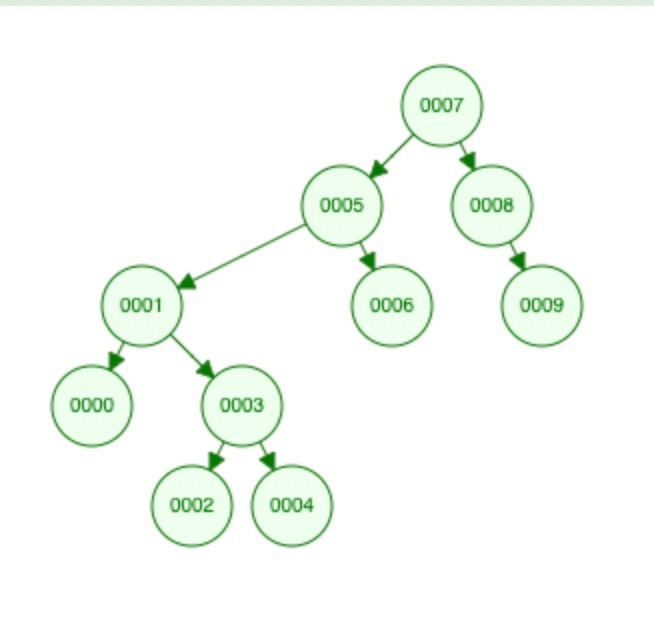

# Binary Search Tree

Binart Search Tree Binary Tree'lerin özelleşmiş halidir. Root, node ve child nodelardan oluşan ağacın her node'u en fazla 2 çocuğa sahip olabilir. Root'dan küçük elemanlar sola yerleşirken büyük olanlar sağa yerleşir.

### Örnek:

[7, 5, 1, 8, 3, 6, 0, 9, 4, 2] dizisinin Binary-Search-Tree aşamalarını yazınız.

* Adım 1) 7 root düğüm olarak seçilir. 5 7'den küçük olduğu için sola yerleşir. 1 7 den ve 5 den küçük olduğu için 5'inde altında solda yer alır.

* Adım 2) 8 7'den büyük olduğu için ağacın sağına eklenen ilk düğüm olur. 3 7 den ve 5 küçük olduğu için sol alta doğru ilerler. Fakat 1'den büyük olduğu için 1'e bağlı düğüm olarak sağ tarafa yerleşir.

* Adım 3) 6 7'den küçük olduğu için sol tarafa yönlenir. 5 den büyük olduğu için 5'e bağlı sağ node oluşturur. 0, 7 5 ve 1 den küçük olduğu için en sol köşeye yerleşir.

* Adım 4) 9, 7 ve 8' den büyk olduğu için en sağ köşeye yerleşir. 4, 7 ve 5 den küçük 1'den büyük ve 3'den büyük olduğu için 3'e bağlı sağ düğüme yerleşir.

* Adım 5) 2, 7 ve 5 den küçük 1 den büyük ve 3'den küçük olduğu için 3'e bağlı sol düğüme yerleşir.

Algoritma tamamlanır.